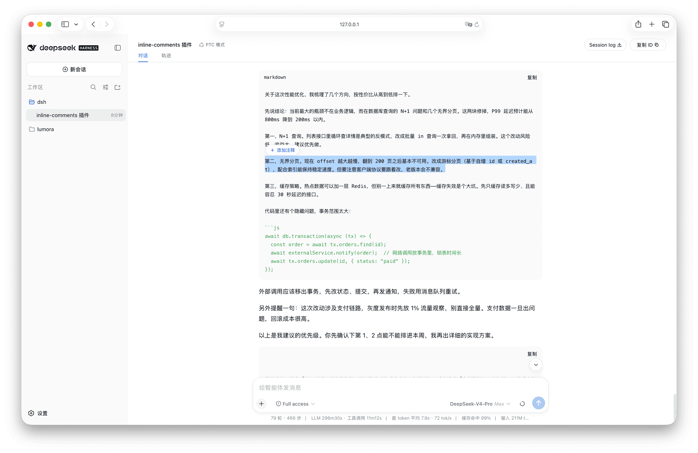

# dsh-inline-comments

DSH Web 的 GPT 式行内批注插件：在对话里选中助手回复的任意文本，就地加批注；发送时批注随正文一并交给模型，模型下一轮逐条回应。



## 功能

- 选中助手文本 → 浮出「＋ 添加注释」按钮 → 点开编辑器写批注。
- 编辑器内：**回车 = 保存**（默认），**Shift+回车 = 换行**。
- 保存后：被批注文本高亮 + 右上角编号气泡；输入框上方出现「N 条注」胶囊。
- 胶囊悬停查看详情、可删除单条；点「×」清空全部（并收回占位字符）。
- 发送时：批注区（`[i] 原文：… / 批注：…`）置于正文之前，中间以 `---` 分割线隔开，模型下一轮逐条回答。
- 发送后即清理（批注是「一次性」的，随发送消费）。
- 支持中文 / 英文（跟随 DSH 语言设置），自动适配亮色 / 暗色主题。
- 跨刷新持久化：批注镜像到宿主侧单一 JSON 文件（默认 `~/.dsh/dsh-inline-comments.json`，可用 `storagePath` 配置覆盖），刷新后自动恢复；发送后自动清理，不留残留。浏览器 localStorage 仅作同页快速镜像。

## 使用

1. 在助手回复里用鼠标选中一段文字。
2. 点浮出的「＋ 添加注释」。
3. 输入批注，回车保存。
4. （可选）再选别的文字继续加；胶囊里可管理 / 删除。
5. 直接回车（或点发送）——正文会带上批注，模型逐条回应。

## 安装

```bash
dsh plugin --profile web add dsh-inline-comments
```

## 架构

- `lib/client.js`（浏览器）：全部功能——高亮 / 气泡 / 胶囊 / 编辑器、批注状态（localStorage + 宿主 JSON 文件）、发送前把摘要拼进草稿。
- `lib/index.js`（宿主进程）：注册 `/_dsh/inline-comments/storage` 路由，把批注持久化到单一 JSON 文件（load / save / clear，仅 loopback、原子写、发送后清理）。
- `cordis.patch.yml`：把插件行插入 web profile 的 roster。

## 开发

- 客户端热更：编辑 `lib/client.js` 后 dsh-client-hmr 自动重载（必要时刷新页面）。
- 宿主改动需重启 `dsh web`。
- 测试：`npm install && npm test`（自测脚本在 `tests/`，覆盖客户端 jsdom、刷新重挂载、宿主路由、宿主文件往返、客户端 fetch 集成）。

## 目录

```
lib/client.js       客户端半部（全部功能）
lib/index.js        宿主半部（存储路由 + JSON 文件持久化）
cordis.patch.yml    web profile 的 bundle patch
package.json        包元信息
tests/              自测脚本（npm test）
market-entry.yml    上架条目（awesome-dsh-plugin）
LICENSE             MIT
```

## 兼容性

面向**最新版 DSH** 开发，不追求兼容所有旧版本；但接口一律走低耦合通道，并把"取不到接口"变成**看得见的日志**，而不是静默失效（静默失效的典型症状：批注加得上、却发不出去）。

- **测试基准**：桌面版（`/Applications/DeepSeek Harness.app`，当前 `0.1.7-rc.2`）—— 它比 Homebrew 的 CLI 发行版更新，插件的新接口风险会先在它这里暴露。
- **已实测**：`0.1.7-rc.2`（桌面版）、`0.1.5-rc.1`（web profile）。
- **低耦合接口**：只用 DOM 契约（`[data-conversation-scroll]`、`[data-composer-input]`、`[data-conversation-session]`）与宿主 `webServer` 的 HTTP 路由；**不使用** typert 生成式远程接口，也不读内部 store 结构。
- **回退**：同一能力尽量留两条路 —— 当前会话 ID（DOM 属性优先 → sessions store 兜底）；发送注入（shell API 优先 → 点发送按钮时由插件接管 → 桥不可用时保留批注并告警）。
- **自测**：`npm test`（88 项）覆盖客户端 jsdom、刷新重挂载、宿主路由与文件往返、会话 ID 的优先级与回退、以及"能力缺失必须告警且不丢批注"。
- **升级 DSH 之后**：先跑 `npm test`，再手测一遍（选中 → 批注 → 发送）；若控制台出现 `[dsh-inline-comments]` 开头的告警，告警里点名的那条接口就是这次被移动的，按它适配即可。

## 反馈

问题反馈与功能建议请提交至 [GitHub Issues](https://github.com/zenvertao/dsh-inline-comments/issues)。

## 许可

[MIT](./LICENSE)
